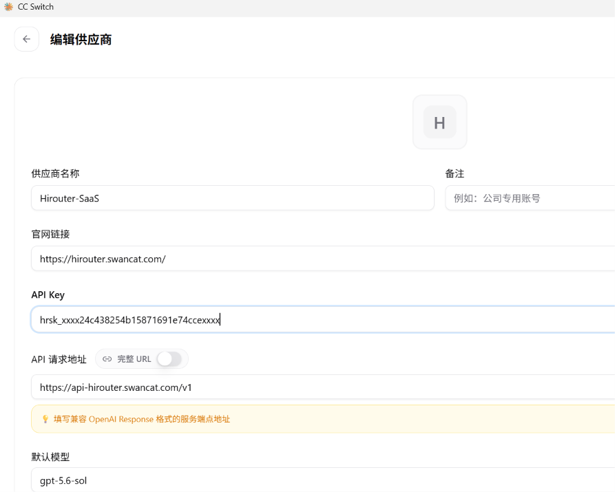

# 使用说明：CC Switch 实测路径

> EN summary: register at https://hirouter.swancat.com, verify email, copy your gateway key (`hrsk_…`), add a custom provider in CC Switch with Base URL `https://api-hirouter.swancat.com/v1` and your key, then call as usual. Limits: 500 requests/day, 60/minute. Usage is counted daily in the console. Never paste your full key in public.

## 1. 注册验证（2 分钟）

1. 打开 https://hirouter.swancat.com，邮箱 + 密码注册（密码至少 8 位）。
2. 查收 6 位验证码（15 分钟内有效，复制时注意全角字符），验证通过即得第一把网关 Key。
3. Key 只显示一次，复制收好。丢了可在控制台 Account 页换新（旧 Key 立刻失效）。

## 2. 接入 CC Switch（3 分钟）

1. 在 CC Switch 设置里添加自定义供应商（custom provider）。
2. 填两个值：
   - Base URL：`https://api-hirouter.swancat.com/v1`
   - API Key：你的网关 Key（`hrsk_` 开头）
3. 模型名不用改，沿用你上游原来的模型名；流式输出、多轮对话照常。
4. 其他兼容 OpenAI / Anthropic 的客户端同理：只改 Base URL 和 Key。

填好的样子（Key 已打码，只露前缀格式）：

## 2b. Codex / opencode 接入

同一把网关 Key、同一个 Base URL（`https://api-hirouter.swancat.com/v1`），换个客户端照填：

- **Codex**：按 Responses API 兼容方式接入，Base URL 与 Key 同上，模型名填网关侧的 `expose_as`。
- **opencode**：provider 里 Base URL 指网关 `/v1`，`modelID` 填 `expose_as`，客户端零改造。

分客户端的三行配置以控制台 Setup guide 为准（跟版本走，本页只记不变的部分）。压缩与改写在网关侧自动生效，Codex 与 opencode 各走一套压缩状态机，详见 [HOW-IT-WORKS.md](HOW-IT-WORKS.md)。

## 3. 确认跑通

- 在客户端发一次普通请求，能正常回包即通。
- 去控制台看"今日请求"涨了 1，用量按天统计（500 次/天，60 次/分钟）。
- 日志页可查自己的请求记录（只含模型名、token 计数等元数据，不含消息内容）。

## 常见问题

- **401**：Key 错了、贴串了行、或用了已换新的旧 Key。去控制台核对前缀，必要时换新。
- **403 trial expired / email not verified**：先验证邮箱；免费公测不限时，限量。
- **429**：今天 500 次用满（UTC 午夜重置）或 1 分钟内超 60 次。结合控制台用量看。
- **模型报错 400**：该模型在当前端点无服务（如纯补全模型走对话端点），换对端点或模型。
- **连不上**：先确认 Base URL 拼写（含 `/v1` 且只含一遍——结尾已有 `/v1` 时不要再加第二遍，`/v1/v1/…` 会被网关直接 404），再看客户端代理/网络。

遇到以上行为一律去 [Issues](https://github.com/etherled/hirouter/issues) 按模板贴复现（不要贴完整 Key 和隐私请求体）。
